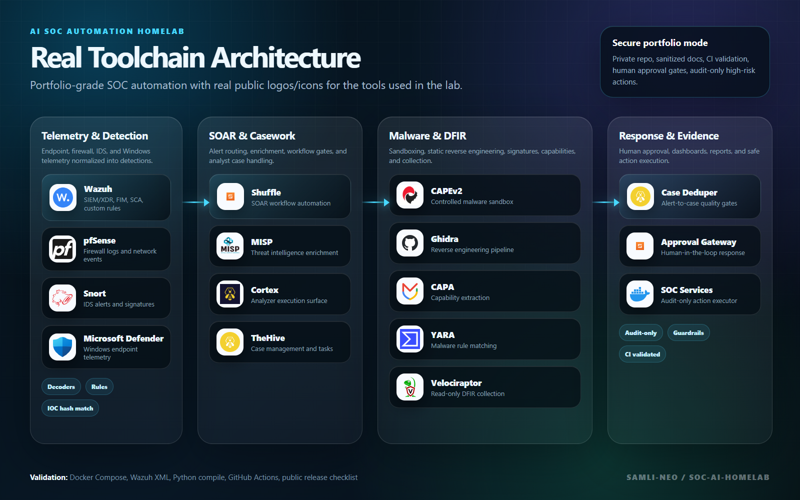
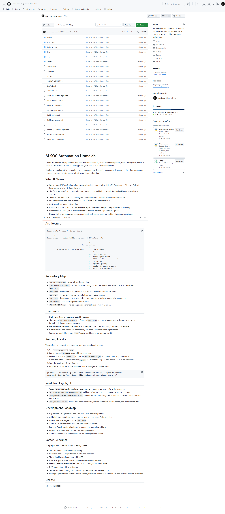
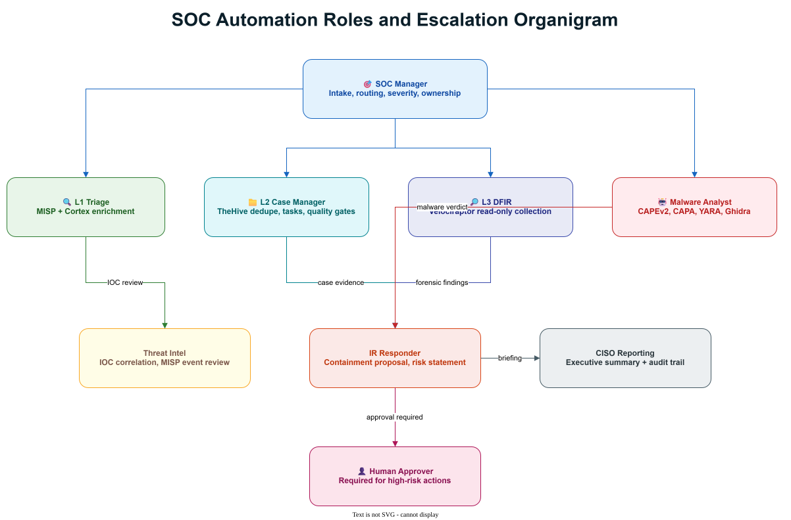

# AI SOC Automation Homelab

An end-to-end security operations homelab that connects SIEM, SOAR, case management, threat intelligence, malware analysis, DFIR collection, and human approval gates into one automated workflow.

This is a personal portfolio project built to demonstrate practical SOC engineering, detection engineering, automation, incident-response guardrails, and infrastructure troubleshooting.

## What It Shows

- Wazuh-based SIEM/XDR ingestion, custom decoders, custom rules, FIM, SCA, Syscollector, Windows Defender telemetry, and MISP IOC correlation.
- Shuffle SOAR workflow orchestration with semantic E2E validation instead of only checking outer workflow success.
- TheHive case deduplication, quality gates, task generation, and incident workflow structure.
- MISP enrichment and unpublished SOC event creation for analyst review.
- Cortex analyzer runner integration.
- CAPEv2 and Ghidra/CAPA/YARA malware-analysis pipeline with explicit degraded-result handling.
- Velociraptor read-only DFIR collection with destructive actions kept approval-gated.
- Human-in-the-loop approval gateway and audit-only action executor for high-risk response actions.
- Operational health checks, workflow watchdog, and SOC dashboard service.

## Architecture

Portfolio landing page preview:



Private GitHub repository review snapshot:



Professional Draw.io diagrams:

- [Editable architecture diagram](docs/diagrams/soc-architecture.drawio)
- [Architecture SVG preview](docs/diagrams/soc-architecture.drawio.svg)
- [Editable SOC role organigram](docs/diagrams/soc-workflow-organigram.drawio)
- [SOC role organigram SVG preview](docs/diagrams/soc-workflow-organigram.drawio.svg)




```text
Wazuh agents / syslog / pfSense / Snort
        |
        v
Wazuh manager -> custom Shuffle integration -> SOC intake router
        |                                      |
        |                                      v
        |                              Shuffle workflow
        |                                      |
        +--> custom rules / MISP CDB lists      +--> MISP runner
                                               +--> Cortex runner
                                               +--> TheHive deduper
                                               +--> Velociraptor runner
                                               +--> CAPE + static malware pipeline
                                               +--> IR advisor
                                               +--> approval gateway
                                               +--> audit-only action executor
                                               +--> reporting / dashboard
```

## Repository Map

- `docker-compose.yml` - main lab service topology.
- `configs/wazuh-manager/` - Wazuh manager config, custom decoders/rules, MISP CDB lists, centralized `agent.conf`.
- `services/` - small internal automation services used by Shuffle and health checks.
- `scripts/` - deploy, test, regression, and phase automation scripts.
- `docs/soc/` - integration notes, playbooks, report templates, and operational documentation.
- `dashboards/` - dashboard specification artifacts.
- `PROJECT_MEMORY.md` - detailed engineering changelog and recovery notes.

## Guardrails

- High-risk actions are approval-gated by design.
- The current `soc-action-executor` defaults to `audit_only` and records approved actions without executing firewall isolation or account changes.
- Fresh malware detonation requires explicit sample input, CAPE availability, and sandbox readiness.
- Wazuh remote commands are intentionally not enabled in centralized agent config.
- Secrets are loaded from local `.env`/service env files and are ignored by Git.

## Running Locally

This project is a homelab reference, not a turnkey cloud deployment.

1. Copy `.env.example` to `.env`.
2. Replace every `change-me` value with a unique secret.
3. Review all absolute `/root/...` mounts in `docker-compose.yml` and adapt them to your lab host.
4. Create the external Docker network `vlan50` or adjust the Compose networking for your environment.
5. Start the stack with Docker Compose.
6. Run validation scripts from PowerShell on the management workstation.

```powershell
powershell -ExecutionPolicy Bypass -File "scripts\test-soc.ps1" -SkipWazuhRegression
powershell -ExecutionPolicy Bypass -File "scripts\test-wazuh-pfsense-snort.ps1"
```

## Validation Highlights

- Wazuh `analysisd` config validation is run before config deployment restarts the manager.
- `scripts/test-wazuh-pfsense-snort.ps1` validates pfSense/Snort decoder and escalation behavior.
- `scripts/test-shuffle-workflow-e2e.ps1` submits a safe alert through the real intake path and checks semantic node results.
- `scripts/test-soc.ps1` checks core container health, service endpoints, Wazuh config, and active agent state.

## Development Roadmap

- Detailed professionalization roadmap: [`docs/professionalization-skill-plan.md`](docs/professionalization-skill-plan.md)

- Replace remaining absolute homelab paths with portable profiles.
- Add CI that runs static syntax checks and unit tests for every Python service.
- Add architecture diagrams under `docs/soc/`.
- Add GitHub Actions secret scanning and container linting.
- Package Wazuh config validation as a standalone reusable workflow.
- Expand detection content with ATT&CK-mapped tests.
- Add clean demo data and screenshots for public portfolio review.

## Career Relevance

This project demonstrates hands-on ability across:

- SOC automation and SOAR engineering
- Detection engineering with Wazuh rules and decoders
- Threat intelligence integration with MISP
- Case management and incident workflow design with TheHive
- Malware-analysis orchestration with CAPEv2, CAPA, YARA, and Ghidra
- DFIR automation with Velociraptor
- Secure automation design with approval gates and audit-only execution
- Debugging distributed systems across Docker, Proxmox, Windows sandbox VMs, and multiple security platforms

## License

MIT. See `LICENSE`.
