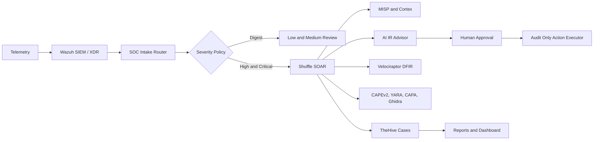

# AI SOC Automation Homelab

[](https://github.com/samli-neo/soc-ai-homelab/actions/workflows/ci.yml)


Private SOC engineering portfolio that connects detection engineering, SOAR orchestration, threat intelligence, malware analysis, DFIR collection, case management, approval gates, and operational health checks into one controlled security-operations workflow.

This is not a toy dashboard or a single-vendor demo. It is a working homelab built to show how a SOC pipeline can ingest real telemetry, normalize alerts, enrich evidence, create cases, run safe automation, and keep high-risk response actions under human control.

---

## Quick Navigation

| Start here | Engineering depth | Proof and safety |
| --- | --- | --- |
| [Why it matters](#why-this-project-matters) | [SOC workflow](#soc-workflow) | [Operational proof points](#operational-proof-points) |
| [Executive summary](#executive-summary) | [Technology stack](#technology-stack) | [Security guardrails](#security-guardrails) |
| [Architecture preview](#architecture-preview) | [Capability map](#capability-map) | [Validation](#validation) |

## At a Glance

| Signal | Value |
| --- | --- |
| Project type | Private SOC automation homelab and engineering portfolio. |
| Security model | AI-assisted, human-approved, audit-only containment by default. |
| Main pipeline | Wazuh -> intake router -> Shuffle -> MISP/Cortex/TheHive/Velociraptor/CAPEv2/Ghidra -> approval/reporting. |
| Main differentiator | Combines deterministic SIEM/SOAR controls with AI-assisted IR recommendations and explicit safety gates. |
| Validation style | CI checks plus live workflow regression that inspects semantic node results. |
| Target audience | SOC engineers, detection engineers, DFIR analysts, security automation engineers, and technical recruiters. |



## Why This Project Matters

Modern SOC teams do not fail because they lack alerts. They fail because alerts are noisy, tools are disconnected, evidence is incomplete, and automation can become dangerous when it skips analyst judgment.

This project addresses that problem as an engineering system:

- Wazuh provides detection, normalization, correlation, and endpoint visibility.
- Shuffle coordinates enrichment and response workflows.
- TheHive turns high-signal alerts into structured cases with task ownership.
- MISP and Cortex enrich observables before an analyst decision.
- CAPEv2, CAPA, YARA, and Ghidra support malware-analysis workflows.
- Velociraptor provides controlled DFIR collection.
- AI-assisted recommendations are allowed, but containment stays approval-gated.

The result is a realistic SOC automation pipeline that balances speed, evidence quality, and safety.

## Executive Summary

| Area | What this project demonstrates |
| --- | --- |
| Detection engineering | Custom Wazuh decoders, rules, correlation logic, MITRE ATT&CK tagging, FIM, SCA, Syscollector, Windows Defender telemetry, pfSense, and Snort ingestion. |
| SOC automation | Shuffle workflow orchestration with semantic validation, digest routing, enrichment fan-out, case creation, DFIR collection, malware-analysis gates, and reporting. |
| Threat intelligence | MISP IOC matching for IPs, domains, and hashes, plus optional unpublished MISP event creation for analyst review. |
| Case management | TheHive deduplication, task ownership, quality gates, templates, dashboards, and controlled alert-to-case promotion. |
| Malware analysis | CAPEv2 lookup/detonation guardrails, CAPA/YARA/static triage, optional Ghidra escalation, and degraded-result handling when sandbox evidence is incomplete. |
| DFIR | Velociraptor read-only collection for mapped endpoints while isolation and destructive actions remain approval-gated. |
| Secure automation | Human approval gateway, Telegram approval workflow, audit-only action executor, per-agent identity model, and explicit kill switches. |
| Platform engineering | Docker Compose SOC stack, Proxmox-backed lab, CI validation, health checks, workflow watchdog, and operator dashboard services. |

## Architecture Preview


Editable diagrams are available for review and reuse:

- [Architecture diagram](docs/diagrams/soc-architecture.drawio)
- [Architecture SVG preview](docs/diagrams/soc-architecture.drawio.svg)
- [SOC role organigram](docs/diagrams/soc-workflow-organigram.drawio)
- [SOC role organigram SVG preview](docs/diagrams/soc-workflow-organigram.drawio.svg)

## SOC Workflow

```text
Telemetry sources
  Wazuh agents, Windows endpoint, pfSense syslog, Snort IDS, MISP IOC lists
        |
        v
Wazuh SIEM/XDR
  Custom decoders, custom rules, ATT&CK mapping, severity policy, correlation
        |
        v
SOC intake router
  Level < 9: digest path
  Level >= 9: full SOAR workflow
        |
        v
Shuffle SOAR workflow
  MISP enrichment -> Cortex analysis -> TheHive dedup/case/task creation
        |              |                 |
        |              |                 v
        |              |          Case quality gates
        |              v
        |       Analyzer evidence
        v
Velociraptor read-only DFIR
CAPEv2 + CAPA + YARA + optional Ghidra malware pipeline
IR AI advisor with approval constraints
Human approval gateway
Audit-only action executor
Reporting and SOC operations dashboard
```

## Core Design Principles

- Alerts should be normalized and scored before automation runs.
- Low-risk enrichment can run automatically; high-risk containment needs explicit human approval.
- Workflow success is not enough; node outputs are parsed for semantic failures.
- Malware analysis can be degraded or inconclusive, and the pipeline must say so clearly.
- Dedicated agent identities are preferred over shared admin credentials.
- Secrets and live credentials stay outside Git.
- The repository must remain reproducible enough for CI while preserving homelab-specific deployment details in documentation.

## AI-Assisted Workflow

The workflow is AI-assisted, not blindly autonomous.

| AI-assisted area | How it is controlled |
| --- | --- |
| Incident-response advice | `soc-ir-ai-advisor` generates recommendations, but high-risk actions are forced into approval flow. |
| Analyst role modeling | Dedicated SOC roles are represented as agent identities for traceability and least-privilege design. |
| Malware triage support | Static and dynamic analysis outputs are structured for analyst/AI correlation instead of raw tool dumps. |
| Reporting | CISO and operational reporting paths consume validated workflow evidence instead of untrusted free-form output. |
| Failure handling | If model calls fail, deterministic safe advice is returned; the workflow does not treat AI failure as benign evidence. |

The AI layer can recommend and summarize. It cannot independently isolate hosts, modify firewall rules, disable accounts, trigger Wazuh active response, or detonate fresh malware samples.

## Demo Scenarios

These scenarios are represented by the repository structure, scripts, and SOC documentation:

| Scenario | Demonstrated workflow |
| --- | --- |
| pfSense firewall escalation | pfSense filterlog is normalized by Wazuh, repeated suspicious blocks are escalated, and high-risk response remains approval-gated. |
| Snort IDS alert triage | Snort CSV fields are decoded, priority is mapped into SOC risk, and cases can be created with detection-engineer task ownership. |
| MISP IOC hit | IP/domain/hash indicators are matched through Wazuh lists and MISP rules, then routed as high or critical SOC risk. |
| Malware hash analysis | Hash-bearing alerts flow through CAPEv2 lookup, CAPA/YARA static triage, optional Ghidra escalation, and case evidence storage. |
| Endpoint DFIR collection | Mapped endpoints can trigger read-only Velociraptor collection while endpoint isolation remains blocked pending approval. |
| Safe workflow regression | A synthetic alert is submitted through the real intake path and the test verifies semantic node results, not only workflow completion. |

## Operational Proof Points

- CI validates Docker Compose syntax, Python service compilation, Wazuh XML fragments, Draw.io files, and high-risk secret patterns.
- Wazuh deployment scripts validate configuration before manager restart and support regression checks.
- Shuffle E2E testing submits a safe alert through the production intake path and checks inner node results for semantic failures.
- TheHive deduplication prevents case floods while preserving duplicate-count context.
- Malware-analysis runners explicitly report degraded or inconclusive states when CAPE or sandbox evidence is unavailable.
- The action executor is intentionally `audit_only` until real adapters, rollback procedures, and execution approvals are implemented.

## Technology Stack

| Layer | Tools |
| --- | --- |
| SIEM/XDR | Wazuh manager, Wazuh indexer, Wazuh dashboard, custom rules, custom decoders. |
| SOAR | Shuffle, custom intake router, workflow watchdog, semantic E2E validation. |
| Case management | TheHive, case deduplication, task assignment, quality gates, report templates. |
| Threat intelligence | MISP IOC lists, MISP enrichment runner, Cortex analyzer runner. |
| Malware analysis | CAPEv2, CAPA, YARA, Ghidra, sandbox VM readiness checks. |
| DFIR | Velociraptor read-only collection runner. |
| Approval and response | Human approval gateway, Telegram approval channel, audit-only action executor. |
| Infrastructure | Docker Compose, Proxmox, pfSense, Snort, Windows sandbox VM, Linux services. |
| Engineering quality | GitHub Actions CI, Dependabot, CODEOWNERS, issue templates, PR template, deployment docs. |

## Capability Map

| Capability | Implementation |
| --- | --- |
| SIEM/XDR | Wazuh manager, indexer, dashboard, centralized agent configuration, custom decoders, custom rules, MISP CDB lists. |
| Network security telemetry | pfSense filterlog and Snort CSV normalization with escalation rules for repeated or high-priority events. |
| Endpoint telemetry | Linux and Windows Wazuh agents with Syscollector, SCA, FIM, Windows Defender event channel, and hotfix inventory. |
| SOAR orchestration | Shuffle production workflow triggered by Wazuh through `custom-shuffle` and `soc-intake-router`. |
| Case management | `soc-thehive-deduper` creates or updates TheHive cases, assigns tasks, and prevents case floods. |
| Threat intel | `soc-misp-runner` enriches observables, handles IOC matches, and can create unpublished review events. |
| Analyzer execution | `soc-cortex-runner` runs or proposes Cortex analyzer jobs according to execution mode. |
| Malware pipeline | `soc-malware-pipeline-runner` coordinates CAPEv2, CAPA, YARA, static triage, artifact storage, and optional Ghidra escalation. |
| DFIR collection | `soc-velociraptor-runner` performs read-only collection from approved client mappings. |
| AI-assisted IR | `soc-ir-ai-advisor` produces constrained recommendations while forcing high-risk actions into approval flow. |
| Human approval | `soc-approval-gateway` records signed approval requests and can notify operators through Telegram. |
| Response execution | `soc-action-executor` records approved actions in `audit_only` mode until real adapters and rollback paths are implemented. |
| Operations | `soc-workflow-watchdog`, `soc-ops-dashboard`, and health scripts detect broken services, stuck workflows, and semantic failures. |

## Repository Map

| Path | Purpose |
| --- | --- |
| `docker-compose.yml` | Main SOC service topology for the homelab reference stack. |
| `configs/wazuh-manager/` | Wazuh manager config, custom decoders/rules, MISP IOC lists, and centralized `agent.conf`. |
| `services/` | Internal Python/Node automation services used by Shuffle, Wazuh integrations, runners, approval flow, and dashboards. |
| `scripts/` | Deployment, regression, workflow E2E, malware VM operations, and SOC phase automation scripts. |
| `docs/soc/` | Integration notes, analyst playbooks, report templates, TheHive notes, and SOC operating documentation. |
| `docs/diagrams/` | Editable Draw.io architecture and role diagrams. |
| `dashboards/` | Dashboard specification artifacts. |
| `.github/` | CI, Dependabot, issue templates, PR template, and CODEOWNERS. |
| `docs/deployment.md` | Deployment, secrets, networking, and validation guide. |
| `docs/public-release-checklist.md` | Required safety checklist before making the private repo public. |

## Security Guardrails

- High-risk response actions are approval-gated by design.
- `soc-action-executor` defaults to `ACTION_EXECUTOR_MODE=audit_only` and records approved actions without changing firewalls, accounts, or endpoints.
- pfSense blocks, Snort rule changes, Velociraptor isolation, Wazuh active response, account disablement, broad collection, and sample detonation require explicit approval.
- Wazuh remote commands are intentionally not enabled in centralized agent configuration.
- Fresh malware detonation requires an explicit sample input, CAPE availability, sandbox readiness, and operator control.
- Secrets are loaded from local `.env` or service-specific env files that are ignored by Git.
- CI includes a high-risk literal secret scan to catch common accidental leaks.

## Validation

The repository includes checks for both portable review and live homelab validation.

Portable checks:

```bash
docker compose --env-file .env.example config --quiet
```

CI validates:

- Docker Compose syntax using a CI-safe generated Compose file.
- Python service compilation under `services/`.
- Wazuh XML fragments and Draw.io files.
- High-risk secret literal patterns.

Live homelab validation from the management workstation:

```powershell
powershell -ExecutionPolicy Bypass -File "scripts\test-soc.ps1" -SkipWazuhRegression
powershell -ExecutionPolicy Bypass -File "scripts\test-wazuh-pfsense-snort.ps1"
powershell -ExecutionPolicy Bypass -File "scripts\test-shuffle-workflow-e2e.ps1"
```

Wazuh deployment with regression:

```powershell
powershell -ExecutionPolicy Bypass -File "scripts\deploy-wazuh-config.ps1" -Restart -RunRegression
```

## Analyst Operating Model

The workflow models a small SOC with explicit responsibilities:

| Role | Responsibility |
| --- | --- |
| L1 triage | Validate alert context, run low-risk enrichment, and reduce noise. |
| L2 case manager | Deduplicate alerts, create cases, assign tasks, and enforce quality gates. |
| Threat intelligence analyst | Review MISP and Cortex enrichment and classify observable risk. |
| Malware analyst | Correlate CAPEv2, CAPA, YARA, Ghidra, and artifact evidence. |
| L3 DFIR analyst | Run approved read-only Velociraptor collection and prepare escalation evidence. |
| IR responder | Propose containment actions and wait for approval before execution. |
| CISO reporting | Produce operational and executive reporting from validated case evidence. |

## Running Locally

This project is a homelab reference architecture, not a turnkey cloud deployment.

1. Copy `.env.example` to `.env`.
2. Replace every `change-me` value with a unique secret.
3. Review absolute `/root/...` mounts in `docker-compose.yml` and adapt them to your lab host.
4. Create the external Docker network `vlan50` or adjust Compose networking for your environment.
5. Start the stack with Docker Compose.
6. Run validation scripts from the management workstation.

Detailed setup notes are in [`docs/deployment.md`](docs/deployment.md).

Before publishing this repository publicly, complete [`docs/public-release-checklist.md`](docs/public-release-checklist.md).

## Career Relevance

This project demonstrates hands-on ability across:

- SOC platform engineering and homelab operations.
- Detection engineering with Wazuh rules, decoders, CDB lists, and ATT&CK mapping.
- SOAR workflow design with Shuffle and semantic E2E validation.
- Case management with TheHive deduplication, task ownership, and quality gates.
- Threat intelligence workflows with MISP and Cortex.
- Malware-analysis orchestration with CAPEv2, CAPA, YARA, and Ghidra.
- DFIR automation with Velociraptor under read-only guardrails.
- Secure automation design with approval gates, audit-only execution, and least-privilege service identities.
- Infrastructure troubleshooting across Docker, Proxmox, pfSense, Windows sandbox VMs, and multiple security platforms.

## Roadmap

- Complete public-release security review and redact private operational notes.
- Replace remaining absolute homelab paths with more portable profiles.
- Expand ATT&CK-mapped detection tests and synthetic alert fixtures.
- Add richer dashboard examples with clean demo data.
- Add container linting and broader static checks.
- Package Wazuh validation as a reusable workflow.

## License

MIT. See [`LICENSE`](LICENSE).
